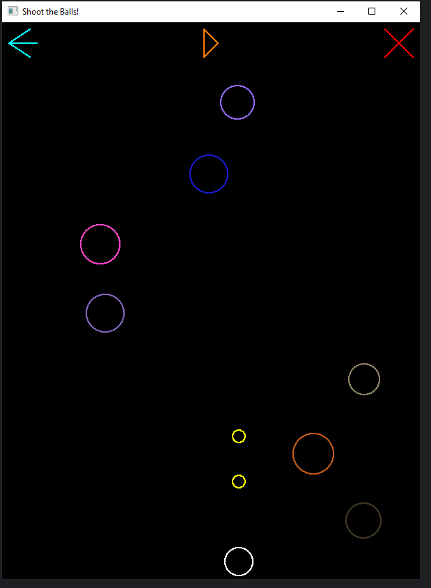

# 🎯 Shoot the Balls!  

A simple OpenGL-based shooting game built with Python.  
You control a shooter at the bottom of the screen and must shoot falling balls before they hit you.  
The game tracks your **score**, **lives**, and **miss fires**, and ends when conditions are met.  

---

## 🕹️ Features
- **Shooter Movement**: Move left/right with `A` and `D` keys.  
- **Shooting**: Press **Spacebar** to fire bullets.  
- **Balls**: Randomly spawn from the top, falling down continuously.  
- **Lives**: Lose a life if a ball touches the ground or hits you.  
- **Miss Fires**: Too many bullets fired without hitting a ball ends the game.  
- **Controls via Mouse**:
  - 🔄 Left Arrow button → Restart game.  
  - ⏯️ Play/Pause button → Pause or resume.  
  - ❌ Cross button → Quit game.  

---

## 📸 In-Game Screenshots  

<p align="center">
  
  
</p>

---

## 🚀 Installation & Run  

1. Clone the Repository
   ```bash
   git clone https://github.com/yourusername/shoot-the-balls.git
   cd shoot-the-balls
2. Install Dependencies
   ```bash
   pip install PyOpenGL PyOpenGL_accelerate
3. Run the Game
   ```bash
   python shoot_the_balls.py

---

## 🎮 Controls

A -> Move shooter left
D -> Move shooter right
Space -> Shoot bullet
Left Arrow Button -> Restart game
Play/Pause Button -> Pause/Resume
Cross Button -> Exit game
